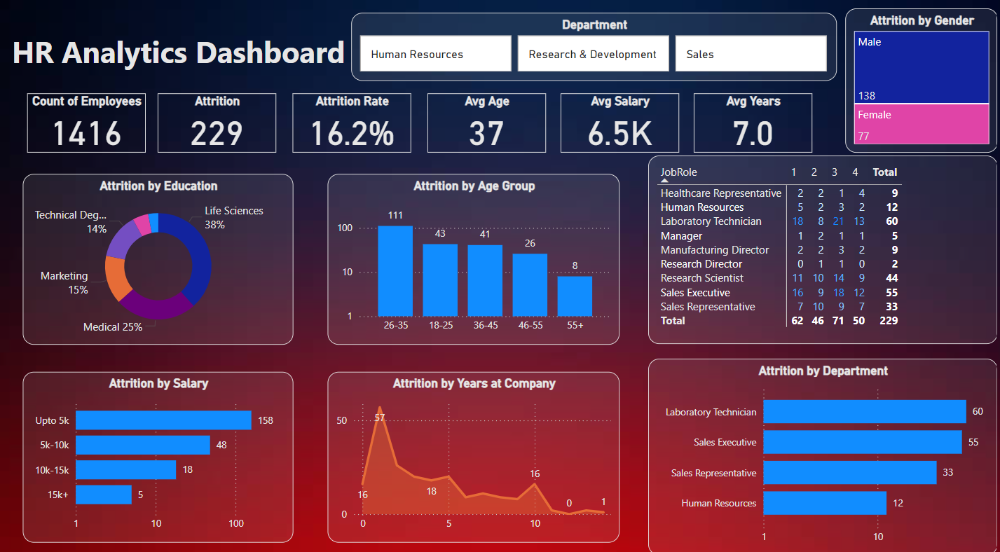

# HR Data Analytics Dashboard

Welcome to the HR Data Analytics Dashboard repository! This Power BI dashboard is designed to provide comprehensive insights into HR-related metrics such as employee attrition, demographics, and work-life balance. By leveraging this dashboard, HR professionals can make data-driven decisions to improve employee retention and understand key factors influencing workforce dynamics.

## Overview

Employee attrition is a critical challenge for any organization. Understanding why employees leave, identifying at-risk groups, and taking proactive measures can significantly reduce turnover rates. This dashboard helps HR teams to:

- **Identify Patterns**: Discover trends in employee attrition across different departments, job roles, and demographic segments.
- **Analyze Demographics**: Gain insights into the age distribution, gender diversity, and educational backgrounds of employees.
- **Evaluate Work-Life Balance**: Assess how work-life balance varies across the organization and its impact on employee satisfaction.

## Dataset Details

The dashboard is built using the `HR_Analytics.csv` dataset, which includes a variety of attributes related to employees' work experience and personal demographics. Below are some of the key fields:

- **EmpID**: Unique employee identifier.
- **Age**: Employee age, categorized into age groups.
- **Attrition**: Whether the employee has left the company (Yes/No).
- **BusinessTravel**: Frequency of business travel for the employee.
- **Department**: The department where the employee works (e.g., Sales, Research & Development).
- **Education**: Employee's level of education.
- **JobRole**: Specific role within the company (e.g., Sales Executive, Research Scientist).
- **TotalWorkingYears**: The total number of years the employee has worked professionally.
- **WorkLifeBalance**: Self-assessed work-life balance on a scale of 1-4.

And many other attributes that help in painting a full picture of the workforce.

## Key Insights

### Attrition Analysis

- **Identify High-Risk Groups**: The dashboard helps HR professionals pinpoint age groups, departments, and job roles with the highest attrition rates. This allows targeted interventions to improve retention in these areas.
- **Understand Reasons for Leaving**: By correlating attrition data with other variables like job satisfaction, business travel, and work-life balance, HR can better understand why employees are leaving the company.

### Demographics Overview

- **Age and Gender Distribution**: Visualize the distribution of employees by age group and gender, helping HR teams ensure diversity and inclusion within the organization.
- **Educational Backgrounds**: Understand the educational qualifications of the workforce, aiding in strategic planning for training and development programs.

### Work-Life Balance

- **Impact on Retention**: Analyze how work-life balance scores vary across different departments and roles, and how this impacts overall employee satisfaction and retention.
- **Tailored Interventions**: Use insights from the dashboard to design initiatives aimed at improving work-life balance, particularly in high-stress roles or departments.

## Benefits to HR Professionals

This analysis provides numerous benefits to HR teams:

- **Proactive Decision-Making**: By identifying the factors contributing to employee turnover, HR can implement targeted strategies to reduce attrition rates.
- **Enhanced Employee Satisfaction**: Understanding the correlation between job roles, work-life balance, and attrition can help HR create a more supportive and engaging work environment.
- **Diversity and Inclusion**: Insights into demographics allow HR to monitor and improve diversity and inclusion efforts, ensuring a balanced and fair workplace.

## Getting Started

### Prerequisites

To view and interact with the dashboard, you will need:

- [Power BI Desktop](https://powerbi.microsoft.com/desktop/)
- A copy of the `.pbix` file from this repository.

### Usage

1. Clone this repository to your local machine.
2. Open the `HR Data Analytics.pbix` file in Power BI Desktop.
3. Explore the various tabs and visualizations to gain insights from the data.

**THANK YOU**

